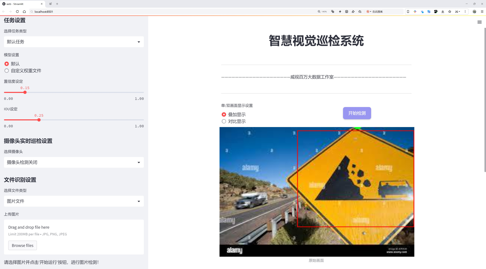

# 交通灯和交通标志类型检测检测系统源码分享
 # [一条龙教学YOLOV8标注好的数据集一键训练_70+全套改进创新点发刊_Web前端展示]

### 1.研究背景与意义

项目参考[AAAI Association for the Advancement of Artificial Intelligence](https://gitee.com/qunmasj/projects)

项目来源[AACV Association for the Advancement of Computer Vision](https://github.com/qunshansj/good)

研究背景与意义

随着城市化进程的加快，交通管理的复杂性日益增加，交通安全问题愈发突出。交通灯和交通标志作为道路交通管理的重要组成部分，承担着引导和规范交通流、保障行车安全的关键角色。然而，传统的交通标志识别和交通灯检测方法往往依赖于人工监控和经验判断，效率低下且容易出现误判。因此，基于计算机视觉和深度学习技术的自动化检测系统应运而生，成为提升交通管理效率和安全性的有效手段。

YOLO（You Only Look Once）系列模型以其快速和高效的目标检测能力，逐渐成为交通标志和交通灯检测领域的研究热点。YOLOv8作为该系列的最新版本，具备更强的特征提取能力和更高的检测精度，能够在复杂的交通环境中快速识别多种交通标志和信号灯。通过对YOLOv8模型的改进，结合特定的数据集，可以进一步提升其在交通标志和交通灯检测中的表现。

本研究所使用的数据集包含4113张图像，涵盖74类交通标志和信号灯，包括限速标志、禁止标志、警告标志等多种类型。这些数据的多样性和丰富性为模型的训练提供了良好的基础，能够有效提升模型的泛化能力和识别准确率。通过对这些数据的深入分析和处理，可以为交通标志和信号灯的自动检测提供更加可靠的解决方案。

本研究的意义不仅在于提升交通标志和信号灯的检测精度，更在于推动智能交通系统的发展。通过构建基于改进YOLOv8的交通灯和交通标志类型检测系统，可以为智能交通管理提供实时、准确的数据支持，帮助交通管理部门及时掌握路况信息，优化交通信号控制，减少交通事故的发生。此外，该系统的应用还可以为自动驾驶技术的发展提供重要的基础数据和算法支持，助力实现更安全、更高效的交通环境。

综上所述，基于改进YOLOv8的交通灯和交通标志类型检测系统的研究，具有重要的理论价值和实际意义。它不仅能够提升交通标志和信号灯的自动检测能力，还将为智能交通系统的建设和发展提供强有力的技术支撑，推动交通管理的智能化和现代化进程。通过本研究的深入探索，期望能够为未来的交通安全和智能交通解决方案提供新的思路和方法，为构建安全、高效、可持续的交通环境贡献力量。

### 2.图片演示




##### 注意：由于此博客编辑较早，上面“2.图片演示”和“3.视频演示”展示的系统图片或者视频可能为老版本，新版本在老版本的基础上升级如下：（实际效果以升级的新版本为准）

  （1）适配了YOLOV8的“目标检测”模型和“实例分割”模型，通过加载相应的权重（.pt）文件即可自适应加载模型。

  （2）支持“图片识别”、“视频识别”、“摄像头实时识别”三种识别模式。

  （3）支持“图片识别”、“视频识别”、“摄像头实时识别”三种识别结果保存导出，解决手动导出（容易卡顿出现爆内存）存在的问题，识别完自动保存结果并导出到tempDir中。

  （4）支持Web前端系统中的标题、背景图等自定义修改，后面提供修改教程。

  另外本项目提供训练的数据集和训练教程,暂不提供权重文件（best.pt）,需要您按照教程进行训练后实现图片演示和Web前端界面演示的效果。

### 3.视频演示

[3.1 视频演示](https://www.bilibili.com/video/BV1LnHEeZERf/?vd_source=ff015de2d29cbe2a9cdbfa7064407a08)

### 4.数据集信息展示

数据集信息展示

在本研究中，我们使用了名为“traffic sign”的数据集，以改进YOLOv8的交通灯和交通标志类型检测系统。该数据集包含74个类别，涵盖了各种交通标志和信号，旨在为计算机视觉模型提供丰富的训练数据，以提高其在复杂交通环境中的识别能力。数据集的多样性和全面性使其成为开发高效、准确的交通标志检测系统的理想选择。

数据集中包含的类别从基本的交通标志到特定的警告和指示标志，反映了现实世界中可能遇到的各种交通情况。例如，数据集中有“Barrier Ahead”（前方障碍物）、“Caution”（小心）和“Dangerous Dip”（危险下坡）等警告标志，这些标志能够提醒驾驶员注意潜在的危险。此外，诸如“Pedestrian Crossing”（人行横道）和“School Ahead”（学校前方）等标志则特别关注行人安全，确保驾驶员在接近学校和人行道时保持警惕。

数据集中的“Speed Limit”类别尤为重要，涵盖了从“-5-”到“-160-”等多个速度限制标志。这些速度限制标志不仅有助于提高交通安全，还能有效地管理交通流量，减少事故发生的可能性。通过训练模型识别这些速度限制标志，系统能够实时监测和提醒驾驶员遵守交通法规，从而提高道路安全性。

此外，数据集中还包括了诸如“Hospital”（医院）、“Public Telephone”（公共电话）和“Resting Place”（休息区）等指示性标志，这些标志为驾驶员提供了重要的服务信息，帮助他们在行驶过程中做出更好的决策。通过准确识别这些标志，交通检测系统能够为用户提供实时导航和服务信息，提升驾驶体验。

在类别设计上，数据集的多样性不仅体现在标志的种类上，还体现在标志的形状、颜色和尺寸等方面。这种多样性确保了模型在面对不同环境和条件时，能够保持较高的识别准确率。例如，“Cycle Crossing”（自行车过路）和“Men at Work”（施工中）等标志在城市环境中尤为常见，模型的准确识别能够有效减少因未能及时注意到这些标志而导致的交通事故。

综上所述，“traffic sign”数据集为改进YOLOv8的交通灯和交通标志类型检测系统提供了坚实的基础。通过对74个类别的全面覆盖，该数据集不仅增强了模型的学习能力，还提高了其在实际应用中的可靠性和准确性。未来的研究将进一步探索如何利用该数据集优化模型的性能，以实现更高效的交通管理和安全保障。


### 5.全套项目环境部署视频教程（零基础手把手教学）

[5.1 环境部署教程链接（零基础手把手教学）](https://www.ixigua.com/7404473917358506534?logTag=c807d0cbc21c0ef59de5)


[5.2 安装Python虚拟环境创建和依赖库安装视频教程链接（零基础手把手教学）](https://www.ixigua.com/7404474678003106304?logTag=1f1041108cd1f708b01a)

### 6.手把手YOLOV8训练视频教程（零基础小白有手就能学会）

[6.1 环境部署教程链接（零基础手把手教学）](https://www.ixigua.com/7404477157818401292?logTag=d31a2dfd1983c9668658)

### 7.70+种全套YOLOV8创新点代码加载调参视频教程（一键加载写好的改进模型的配置文件）

[7.1 环境部署教程链接（零基础手把手教学）](https://www.ixigua.com/7404478314661806627?logTag=29066f8288e3f4eea3a4)

### 8.70+种全套YOLOV8创新点原理讲解（非科班也可以轻松写刊发刊，V10版本正在科研待更新）

由于篇幅限制，每个创新点的具体原理讲解就不一一展开，具体见下列网址中的创新点对应子项目的技术原理博客网址【Blog】：


[8.1 70+种全套YOLOV8创新点原理讲解链接](https://gitee.com/qunmasj/good)

### 9.系统功能展示（检测对象为举例，实际内容以本项目数据集为准）

图9.1.系统支持检测结果表格显示

  图9.2.系统支持置信度和IOU阈值手动调节

  图9.3.系统支持自定义加载权重文件best.pt(需要你通过步骤5中训练获得)

  图9.4.系统支持摄像头实时识别

  图9.5.系统支持图片识别

  图9.6.系统支持视频识别

  图9.7.系统支持识别结果文件自动保存

  图9.8.系统支持Excel导出检测结果数据


### 10.原始YOLOV8算法原理

原始YOLOv8算法原理

YOLOv8算法是YOLO系列目标检测算法的最新版本，由Glenn-Jocher提出，承载着YOLO系列算法在性能和效率上的不断演进。作为一种端到端的目标检测方法，YOLOv8不仅在检测精度上进行了显著提升，同时在模型结构和训练策略上也做出了多项创新。YOLOv8的设计理念是通过高效的特征提取和多尺度信息融合，来实现快速而准确的目标检测，适应不同场景的需求。

YOLOv8的网络结构可以分为三个主要部分：输入端（Input）、主干网络（Backbone）和检测端（Head）。其中，主干网络负责特征提取，检测端则负责最终的目标分类和定位。YOLOv8提供了五种不同规模的模型，分别为YOLOv8n、YOLOv8s、YOLOv8m、YOLOv8l和YOLOv8x，这些模型在深度、特征图宽度和通道数上有所不同，以适应不同的应用场景和计算资源。

在数据预处理方面，YOLOv8延续了YOLOv5的策略，采用了多种数据增强技术，包括马赛克增强、混合增强、空间扰动和颜色扰动等。这些增强手段旨在提高模型的泛化能力，使其在不同环境下都能保持良好的检测性能。尤其是马赛克增强，通过将多张图像拼接在一起，能够有效地提高模型对小目标的检测能力。

YOLOv8的主干网络结构相较于YOLOv5进行了重要的改进。YOLOv5的主干网络采用了C3模块，而YOLOv8则将其替换为新的C2f模块。C2f模块在设计上引入了更多的残差连接，增强了梯度信息的流动，从而在轻量化的基础上提升了特征提取的能力。C2f模块的引入，使得网络在训练过程中能够更好地捕捉到复杂的特征关系，提高了模型的表现。

在特征融合方面，YOLOv8依然采用了FPN（特征金字塔网络）和PAN（路径聚合网络）的结构，这一结构使得多尺度信息能够充分融合。FPN负责从不同层次提取特征，而PAN则在特征融合的基础上进一步增强了上下文信息的流动，确保了模型在面对不同尺度目标时的鲁棒性。YOLOv8在这一结构上进行了优化，将C3模块替换为C2f模块，进一步提升了特征融合的效果。

检测端的设计是YOLOv8的一大亮点。YOLOv8采用了解耦合头结构，将分类和定位任务分开处理。这种设计使得模型能够更加专注于每个任务，避免了传统耦合结构中信息共享带来的干扰。具体而言，YOLOv8的检测头由两条并行的分支组成，分别负责提取类别特征和位置特征，最终通过1×1卷积层完成分类和定位任务。这种解耦合的设计在提升检测精度的同时，也提高了模型的计算效率。

在标签分配策略上，YOLOv8采用了动态标签分配策略TOOD（Task-Aligned Object Detection），这一策略通过动态调整正负样本的匹配方式，解决了传统方法中候选框聚类不准确的问题。YOLOv8的损失函数设计也进行了创新，分类损失采用了VFL（Varifocal Loss），而回归损失则结合了CIoULoss和DFLLoss。这种损失函数的设计使得模型在训练过程中能够更加关注高质量的正样本，同时降低负样本对损失的影响，从而提升了模型的整体性能。

YOLOv8的训练过程也引入了新的策略，例如在训练的最后10个epoch中关闭马赛克增强，这一策略旨在减少训练过程中的噪声，帮助模型更好地收敛。此外，YOLOv8的Pytorch训练和部署框架的引入，使得自定义模型的训练变得更加方便，极大地提升了用户的使用体验。

综上所述，YOLOv8在多个方面进行了创新和优化，从数据预处理到网络结构，再到损失函数和训练策略，均体现了对目标检测任务的深刻理解和对实际应用需求的敏锐把握。通过这些改进，YOLOv8不仅在精度上超越了前代模型，也在计算效率上做出了显著提升，成为了目标检测领域的重要里程碑。


### 11.项目核心源码讲解（再也不用担心看不懂代码逻辑）

#### 11.1 ui.py

以下是对给定代码的核心部分进行提炼和详细注释的版本：

```python
import sys  # 导入系统模块，用于获取当前 Python 解释器的路径
import subprocess  # 导入子进程模块，用于执行外部命令
from QtFusion.path import abs_path  # 从 QtFusion.path 导入 abs_path 函数，用于获取绝对路径

def run_script(script_path):
    """
    使用当前 Python 环境运行指定的脚本。

    Args:
        script_path (str): 要运行的脚本路径

    Returns:
        None
    """
    # 获取当前 Python 解释器的路径
    python_path = sys.executable

    # 构建运行命令，使用 streamlit 运行指定的脚本
    command = f'"{python_path}" -m streamlit run "{script_path}"'

    # 执行命令，并等待其完成
    result = subprocess.run(command, shell=True)
    
    # 检查命令执行结果，如果返回码不为0，表示执行出错
    if result.returncode != 0:
        print("脚本运行出错。")

# 实例化并运行应用
if __name__ == "__main__":
    # 指定要运行的脚本路径，并获取其绝对路径
    script_path = abs_path("web.py")

    # 调用函数运行指定的脚本
    run_script(script_path)
```

### 代码核心部分分析：
1. **模块导入**：
   - `sys`模块用于获取当前 Python 解释器的路径，以便后续调用。
   - `subprocess`模块用于执行外部命令，这里用于运行 `streamlit`。
   - `abs_path`函数用于将相对路径转换为绝对路径，确保脚本可以被正确找到。

2. **`run_script`函数**：
   - 该函数接受一个脚本路径作为参数，并在当前 Python 环境中运行该脚本。
   - 使用 `sys.executable` 获取当前 Python 解释器的路径，以确保脚本在正确的环境中运行。
   - 构建一个命令字符串，使用 `streamlit` 运行指定的脚本。
   - 使用 `subprocess.run` 执行命令，并检查返回码以判断脚本是否成功运行。

3. **主程序入口**：
   - 在 `if __name__ == "__main__":` 语句中，确保该脚本作为主程序运行时才会执行以下代码。
   - 使用 `abs_path` 获取 `web.py` 的绝对路径，并调用 `run_script` 函数运行该脚本。

这段代码的核心功能是启动一个 `streamlit` 应用，确保其在当前 Python 环境中正确运行。

这个程序文件名为 `ui.py`，其主要功能是运行一个指定的 Python 脚本，具体来说是使用 Streamlit 框架来启动一个 Web 应用。

首先，文件导入了几个必要的模块，包括 `sys`、`os` 和 `subprocess`。其中，`sys` 模块用于访问与 Python 解释器相关的变量和函数，`os` 模块提供了与操作系统交互的功能，而 `subprocess` 模块则用于生成新的进程、连接到它们的输入/输出/错误管道，并获取它们的返回码。

接下来，程序定义了一个名为 `run_script` 的函数，该函数接受一个参数 `script_path`，表示要运行的脚本的路径。在函数内部，首先通过 `sys.executable` 获取当前 Python 解释器的路径，这样可以确保使用正确的 Python 环境来运行脚本。然后，构建一个命令字符串，格式为 `"{python_path}" -m streamlit run "{script_path}"`，这个命令的作用是使用 Streamlit 模块来运行指定的脚本。

接着，使用 `subprocess.run` 方法执行构建好的命令。这个方法会在一个新的 shell 中运行命令，并等待其完成。运行完成后，程序检查返回码，如果返回码不为 0，表示脚本运行过程中出现了错误，此时会打印出“脚本运行出错。”的提示信息。

在文件的最后部分，使用 `if __name__ == "__main__":` 语句来确保只有在直接运行该脚本时才会执行以下代码。这里指定了要运行的脚本路径为 `web.py`，这个路径是通过调用 `abs_path` 函数获得的，`abs_path` 函数的具体实现可能在 `QtFusion.path` 模块中，通常用于获取脚本的绝对路径。最后，调用 `run_script` 函数来执行指定的脚本。

总体来说，这个文件的主要作用是为运行一个基于 Streamlit 的 Web 应用提供一个简单的接口，通过指定脚本路径，用户可以方便地启动相应的应用。

#### 11.2 ultralytics\utils\callbacks\mlflow.py

以下是代码中最核心的部分，并附上详细的中文注释：

```python
from ultralytics.utils import LOGGER, RUNS_DIR, SETTINGS, TESTS_RUNNING, colorstr

try:
    import os

    # 确保不是在运行测试（pytest），并且MLflow集成已启用
    assert not TESTS_RUNNING or "test_mlflow" in os.environ.get("PYTEST_CURRENT_TEST", "")
    assert SETTINGS["mlflow"] is True  # 验证MLflow集成是否启用
    import mlflow

    assert hasattr(mlflow, "__version__")  # 验证mlflow包是否正确导入
    from pathlib import Path

    PREFIX = colorstr("MLflow: ")  # 设置日志前缀
    # 清理日志参数的函数，将元组中的键值对转换为浮点数
    SANITIZE = lambda x: {k.replace("(", "").replace(")", ""): float(v) for k, v in x.items()}

except (ImportError, AssertionError):
    mlflow = None  # 如果导入失败或验证失败，则将mlflow设置为None


def on_pretrain_routine_end(trainer):
    """
    在预训练例程结束时记录训练参数到MLflow。

    该函数根据环境变量和训练器参数设置MLflow日志。它设置跟踪URI、实验名称和运行名称，
    然后启动MLflow运行（如果尚未激活）。最后记录训练器的参数。

    参数:
        trainer (ultralytics.engine.trainer.BaseTrainer): 包含要记录的参数和参数的训练对象。

    全局变量:
        mlflow: 用于记录的mlflow模块。

    环境变量:
        MLFLOW_TRACKING_URI: MLflow跟踪的URI。如果未设置，默认为'runs/mlflow'。
        MLFLOW_EXPERIMENT_NAME: MLflow实验的名称。如果未设置，默认为trainer.args.project。
        MLFLOW_RUN: MLflow运行的名称。如果未设置，默认为trainer.args.name。
    """
    global mlflow

    # 获取跟踪URI，如果未设置则使用默认值
    uri = os.environ.get("MLFLOW_TRACKING_URI") or str(RUNS_DIR / "mlflow")
    LOGGER.debug(f"{PREFIX} tracking uri: {uri}")
    mlflow.set_tracking_uri(uri)

    # 设置实验和运行名称
    experiment_name = os.environ.get("MLFLOW_EXPERIMENT_NAME") or trainer.args.project or "/Shared/YOLOv8"
    run_name = os.environ.get("MLFLOW_RUN") or trainer.args.name
    mlflow.set_experiment(experiment_name)

    mlflow.autolog()  # 自动记录参数和指标
    try:
        # 开始一个新的MLflow运行
        active_run = mlflow.active_run() or mlflow.start_run(run_name=run_name)
        LOGGER.info(f"{PREFIX}logging run_id({active_run.info.run_id}) to {uri}")
        if Path(uri).is_dir():
            LOGGER.info(f"{PREFIX}view at http://127.0.0.1:5000 with 'mlflow server --backend-store-uri {uri}'")
        LOGGER.info(f"{PREFIX}disable with 'yolo settings mlflow=False'")
        mlflow.log_params(dict(trainer.args))  # 记录训练参数
    except Exception as e:
        LOGGER.warning(f"{PREFIX}WARNING ⚠️ Failed to initialize: {e}\n" f"{PREFIX}WARNING ⚠️ Not tracking this run")


def on_train_end(trainer):
    """在训练结束时记录模型工件到MLflow。"""
    if mlflow:
        # 记录最佳模型的文件
        mlflow.log_artifact(str(trainer.best.parent))  # 记录保存目录
        for f in trainer.save_dir.glob("*"):  # 记录保存目录中的所有文件
            if f.suffix in {".png", ".jpg", ".csv", ".pt", ".yaml"}:
                mlflow.log_artifact(str(f))

        mlflow.end_run()  # 结束当前的MLflow运行
        LOGGER.info(
            f"{PREFIX}results logged to {mlflow.get_tracking_uri()}\n"
            f"{PREFIX}disable with 'yolo settings mlflow=False'"
        )


# 定义回调函数
callbacks = (
    {
        "on_pretrain_routine_end": on_pretrain_routine_end,
        "on_train_end": on_train_end,
    }
    if mlflow
    else {}
)
```

### 代码说明：
1. **导入模块**：导入必要的模块和工具，包括日志记录、路径处理和MLflow。
2. **环境变量检查**：确保在适当的环境中运行，且MLflow集成已启用。
3. **日志记录函数**：
   - `on_pretrain_routine_end`：在预训练结束时记录训练参数，包括设置跟踪URI、实验名称和运行名称，并记录训练参数。
   - `on_train_end`：在训练结束时记录模型的工件（如最佳模型文件和其他相关文件）。
4. **回调函数**：定义在特定事件（如预训练结束和训练结束）时调用的回调函数。

这个程序文件是用于Ultralytics YOLO模型的MLflow日志记录模块。MLflow是一个开源平台，用于管理机器学习实验，包括模型的训练、参数、指标和工件的记录。该模块主要实现了在训练过程中记录相关信息的功能。

首先，文件中定义了一些环境变量和命令，用户可以通过这些环境变量来配置MLflow的项目名称、运行名称和跟踪URI。具体来说，用户可以通过设置`MLFLOW_EXPERIMENT_NAME`和`MLFLOW_RUN`来指定实验和运行的名称。此外，用户还可以启动一个本地的MLflow服务器，以便查看记录的实验数据。

接下来，文件中导入了一些必要的库和模块，包括`os`、`mlflow`和`pathlib`。在导入时，程序会进行一些检查，以确保MLflow模块正确安装，并且集成设置已启用。若未通过检查，`mlflow`将被设置为`None`，以避免后续调用时出错。

该模块定义了几个回调函数，主要用于在不同的训练阶段记录信息。`on_pretrain_routine_end`函数在预训练例程结束时被调用，主要用于设置MLflow的跟踪URI、实验名称和运行名称，并记录训练参数。它会检查当前是否已有活动的运行，如果没有，则启动一个新的运行，并记录相关参数。

`on_train_epoch_end`和`on_fit_epoch_end`函数分别在每个训练和拟合的周期结束时被调用，用于记录训练指标。这些函数会将当前的损失和学习率等指标记录到MLflow中。

最后，`on_train_end`函数在训练结束时被调用，主要用于记录模型的工件。这包括将最佳模型和其他相关文件（如图像、CSV、YAML等）记录到MLflow中，并结束当前的运行。

整个模块的最后部分定义了一个回调字典，只有在`mlflow`可用时才会包含相应的回调函数。这使得模块的使用更加灵活，用户可以根据需要选择是否启用MLflow的日志记录功能。通过这种方式，Ultralytics YOLO模型能够有效地管理和记录训练过程中的重要信息，便于后续的分析和复现。

#### 11.3 ultralytics\engine\trainer.py

以下是经过简化并添加详细中文注释的核心代码部分：

```python
class BaseTrainer:
    """
    BaseTrainer 类用于创建训练器的基类。

    属性:
        args (SimpleNamespace): 训练器的配置。
        model (nn.Module): 模型实例。
        device (torch.device): 训练所用的设备。
        epochs (int): 训练的总轮数。
        batch_size (int): 每个批次的样本数量。
        optimizer (torch.optim.Optimizer): 优化器实例。
        train_loader (DataLoader): 训练数据加载器。
        metrics (dict): 训练过程中的指标。
    """

    def __init__(self, cfg=DEFAULT_CFG, overrides=None):
        """
        初始化 BaseTrainer 类。

        参数:
            cfg (str, optional): 配置文件的路径，默认为 DEFAULT_CFG。
            overrides (dict, optional): 配置覆盖，默认为 None。
        """
        self.args = get_cfg(cfg, overrides)  # 获取配置
        self.device = select_device(self.args.device, self.args.batch)  # 选择设备
        self.model = check_model_file_from_stem(self.args.model)  # 检查模型文件
        self.epochs = self.args.epochs  # 设置训练轮数
        self.batch_size = self.args.batch  # 设置批次大小

        # 初始化数据集和数据加载器
        self.trainset, self.testset = self.get_dataset(self.args.data)  # 获取训练和测试数据集
        self.train_loader = self.get_dataloader(self.trainset, batch_size=self.batch_size)  # 创建训练数据加载器

        # 初始化优化器
        self.optimizer = self.build_optimizer(self.model, lr=self.args.lr0)  # 构建优化器

    def train(self):
        """开始训练过程。"""
        for epoch in range(self.epochs):
            self.model.train()  # 设置模型为训练模式
            for batch in self.train_loader:  # 遍历训练数据加载器
                self.optimizer.zero_grad()  # 清空梯度
                loss = self.model(batch)  # 前向传播计算损失
                loss.backward()  # 反向传播计算梯度
                self.optimizer.step()  # 更新模型参数

            # 记录和打印训练指标
            self.log_metrics(epoch)

    def build_optimizer(self, model, lr=0.001):
        """
        构建优化器。

        参数:
            model (torch.nn.Module): 要优化的模型。
            lr (float): 学习率。

        返回:
            (torch.optim.Optimizer): 构建的优化器。
        """
        return optim.Adam(model.parameters(), lr=lr)  # 使用 Adam 优化器

    def get_dataset(self, data):
        """
        从数据字典中获取训练和验证路径。

        返回:
            (train, val): 训练和验证数据路径。
        """
        return data["train"], data.get("val")  # 返回训练和验证数据路径

    def get_dataloader(self, dataset_path, batch_size=16):
        """
        返回数据加载器。

        参数:
            dataset_path: 数据集路径。
            batch_size: 批次大小。

        返回:
            DataLoader: 数据加载器实例。
        """
        dataset = ...  # 根据路径加载数据集
        return DataLoader(dataset, batch_size=batch_size, shuffle=True)  # 创建数据加载器

    def log_metrics(self, epoch):
        """记录和打印训练指标。"""
        # 记录当前轮次的训练指标
        print(f"Epoch {epoch + 1}/{self.epochs} completed.")
```

### 代码说明：
1. **BaseTrainer 类**：这是一个训练器的基类，负责初始化模型、数据集、优化器等，并提供训练方法。
2. **`__init__` 方法**：初始化训练器的配置、设备、模型、数据集和优化器。
3. **train 方法**：执行训练过程，遍历每个 epoch 和每个批次，进行前向传播、反向传播和参数更新。
4. **build_optimizer 方法**：构建优化器，这里使用 Adam 优化器。
5. **get_dataset 方法**：从给定的数据字典中获取训练和验证数据路径。
6. **get_dataloader 方法**：根据数据集路径创建数据加载器。
7. **log_metrics 方法**：记录和打印训练指标。

这些核心部分和注释提供了对训练过程的基本理解和实现细节。

这个程序文件是Ultralytics YOLO（You Only Look Once）框架中的一个训练器类，主要用于训练目标检测模型。文件中定义了一个名为`BaseTrainer`的类，该类封装了训练过程中的各种功能和设置。

首先，`BaseTrainer`类的构造函数`__init__`接受配置文件路径和可选的覆盖参数，初始化训练器的各种属性，包括模型、数据集、优化器、学习率调度器等。它还会根据提供的配置文件检查是否需要恢复之前的训练状态，并设置设备（如CPU或GPU）进行训练。

在训练过程中，`train`方法负责管理训练的主要流程。它会根据设备的数量决定是否使用分布式数据并行（DDP）进行训练。如果是多GPU训练，它会生成相应的命令并通过子进程启动训练。否则，它会直接调用`_do_train`方法进行训练。

`_do_train`方法中，训练过程被细分为多个步骤，包括设置模型、优化器、数据加载器等。它会在每个epoch中进行训练，更新模型参数，并在必要时进行验证。训练过程中，使用了自动混合精度（AMP）来提高训练效率，尤其是在使用GPU时。

在每个batch的训练中，模型会进行前向传播计算损失，并通过反向传播更新参数。训练过程中还会记录各种指标，如损失值、最佳适应度等，并在每个epoch结束时进行验证。如果满足保存条件，模型的权重会被保存到指定的路径。

此外，`BaseTrainer`类还定义了一些辅助方法，例如`save_model`用于保存模型的检查点，`validate`用于在验证集上评估模型性能，`build_optimizer`用于构建优化器等。这些方法使得训练过程更加模块化和灵活。

总的来说，这个文件提供了一个全面的训练框架，能够支持不同的任务和配置，使得用户可以方便地训练YOLO模型。通过合理的设计，代码实现了高效的训练流程，同时也提供了良好的可扩展性，便于后续的功能扩展和优化。

#### 11.4 ultralytics\models\utils\loss.py

以下是代码中最核心的部分，并附上详细的中文注释：

```python
import torch
import torch.nn as nn
import torch.nn.functional as F
from ultralytics.utils.loss import FocalLoss, VarifocalLoss
from ultralytics.utils.metrics import bbox_iou
from .ops import HungarianMatcher

class DETRLoss(nn.Module):
    """
    DETR (DEtection TRansformer) 损失类。该类计算并返回DETR目标检测模型的不同损失组件。
    计算分类损失、边界框损失、GIoU损失，并可选择性地计算辅助损失。
    """

    def __init__(self, nc=80, loss_gain=None, aux_loss=True, use_fl=True, use_vfl=False):
        """
        初始化DETR损失函数。

        参数:
            nc (int): 类别数量。
            loss_gain (dict): 各种损失组件的系数。
            aux_loss (bool): 是否计算辅助损失。
            use_fl (bool): 是否使用FocalLoss。
            use_vfl (bool): 是否使用VarifocalLoss。
        """
        super().__init__()

        # 设置损失系数，默认值
        if loss_gain is None:
            loss_gain = {"class": 1, "bbox": 5, "giou": 2}
        self.nc = nc  # 类别数量
        self.matcher = HungarianMatcher(cost_gain={"class": 2, "bbox": 5, "giou": 2})  # 匹配器
        self.loss_gain = loss_gain  # 损失系数
        self.aux_loss = aux_loss  # 是否计算辅助损失
        self.fl = FocalLoss() if use_fl else None  # Focal Loss对象
        self.vfl = VarifocalLoss() if use_vfl else None  # Varifocal Loss对象
        self.device = None  # 设备

    def _get_loss_class(self, pred_scores, targets, gt_scores, num_gts):
        """计算分类损失。"""
        bs, nq = pred_scores.shape[:2]  # 获取批次大小和查询数量
        one_hot = torch.zeros((bs, nq, self.nc + 1), dtype=torch.int64, device=targets.device)  # 创建one-hot编码
        one_hot.scatter_(2, targets.unsqueeze(-1), 1)  # 将目标值转换为one-hot编码
        one_hot = one_hot[..., :-1]  # 去掉最后一列（背景类）
        gt_scores = gt_scores.view(bs, nq, 1) * one_hot  # 计算真实分数

        # 使用Focal Loss或普通的BCE损失
        if self.fl:
            loss_cls = self.vfl(pred_scores, gt_scores, one_hot) if num_gts else self.fl(pred_scores, one_hot.float())
            loss_cls /= max(num_gts, 1) / nq  # 归一化损失
        else:
            loss_cls = nn.BCEWithLogitsLoss(reduction="none")(pred_scores, gt_scores).mean(1).sum()  # 计算BCE损失

        return {"loss_class": loss_cls.squeeze() * self.loss_gain["class"]}  # 返回分类损失

    def _get_loss_bbox(self, pred_bboxes, gt_bboxes):
        """计算边界框损失和GIoU损失。"""
        loss = {}
        if len(gt_bboxes) == 0:  # 如果没有真实边界框
            loss["loss_bbox"] = torch.tensor(0.0, device=self.device)
            loss["loss_giou"] = torch.tensor(0.0, device=self.device)
            return loss

        # 计算L1损失和GIoU损失
        loss["loss_bbox"] = self.loss_gain["bbox"] * F.l1_loss(pred_bboxes, gt_bboxes, reduction="sum") / len(gt_bboxes)
        loss["loss_giou"] = 1.0 - bbox_iou(pred_bboxes, gt_bboxes, xywh=True, GIoU=True)
        loss["loss_giou"] = loss["loss_giou"].sum() / len(gt_bboxes) * self.loss_gain["giou"]
        return {k: v.squeeze() for k, v in loss.items()}  # 返回损失字典

    def _get_loss(self, pred_bboxes, pred_scores, gt_bboxes, gt_cls, gt_groups):
        """计算所有损失。"""
        match_indices = self.matcher(pred_bboxes, pred_scores, gt_bboxes, gt_cls, gt_groups)  # 获取匹配索引
        idx, gt_idx = self._get_index(match_indices)  # 获取索引
        pred_bboxes, gt_bboxes = pred_bboxes[idx], gt_bboxes[gt_idx]  # 获取匹配的边界框

        # 创建目标类标签
        bs, nq = pred_scores.shape[:2]
        targets = torch.full((bs, nq), self.nc, device=pred_scores.device, dtype=gt_cls.dtype)
        targets[idx] = gt_cls[gt_idx]

        gt_scores = torch.zeros([bs, nq], device=pred_scores.device)
        if len(gt_bboxes):
            gt_scores[idx] = bbox_iou(pred_bboxes.detach(), gt_bboxes, xywh=True).squeeze(-1)  # 计算真实分数

        # 计算分类损失和边界框损失
        loss = {}
        loss.update(self._get_loss_class(pred_scores, targets, gt_scores, len(gt_bboxes)))
        loss.update(self._get_loss_bbox(pred_bboxes, gt_bboxes))
        return loss  # 返回所有损失

    def forward(self, pred_bboxes, pred_scores, batch):
        """
        前向传播计算损失。

        参数:
            pred_bboxes (torch.Tensor): 预测的边界框。
            pred_scores (torch.Tensor): 预测的分数。
            batch (dict): 包含真实标签的字典。

        返回:
            (dict): 包含总损失的字典。
        """
        self.device = pred_bboxes.device  # 设置设备
        gt_cls, gt_bboxes, gt_groups = batch["cls"], batch["bboxes"], batch["gt_groups"]  # 获取真实标签

        total_loss = self._get_loss(pred_bboxes[-1], pred_scores[-1], gt_bboxes, gt_cls, gt_groups)  # 计算总损失
        return total_loss  # 返回总损失
```

### 代码核心部分说明：
1. **类定义**：`DETRLoss`类用于计算DETR模型的损失，包括分类损失和边界框损失。
2. **初始化方法**：设置类别数量、损失系数、是否使用Focal Loss和Varifocal Loss等参数。
3. **损失计算方法**：
   - `_get_loss_class`：计算分类损失。
   - `_get_loss_bbox`：计算边界框损失和GIoU损失。
   - `_get_loss`：整合所有损失的计算。
4. **前向传播**：`forward`方法负责接收预测结果和真实标签，并计算总损失。

这个程序文件是用于实现DETR（DEtection TRansformer）模型的损失计算，主要用于目标检测任务。它定义了一个名为`DETRLoss`的类，该类继承自`torch.nn.Module`，并实现了多种损失计算方法，包括分类损失、边界框损失和GIoU（广义交并比）损失。类的构造函数接收多个参数，如类别数量、损失系数、是否使用辅助损失等，并初始化相应的属性。

在`DETRLoss`类中，损失计算的核心方法包括`_get_loss_class`、`_get_loss_bbox`和`_get_loss`。`_get_loss_class`方法计算分类损失，使用了Focal Loss或Varifocal Loss来处理类别不平衡问题。`_get_loss_bbox`方法计算边界框的L1损失和GIoU损失，确保预测的边界框与真实边界框之间的差异最小化。`_get_loss`方法整合了分类损失和边界框损失的计算，并根据匹配索引将预测框与真实框进行关联。

此外，`DETRLoss`类还支持计算辅助损失，辅助损失是在解码器的每一层计算的，使用`_get_loss_aux`方法来实现。这个方法会遍历所有的辅助预测，计算它们的损失并累加。

文件中还定义了一个名为`RTDETRDetectionLoss`的类，它继承自`DETRLoss`，并在此基础上增加了对去噪训练损失的支持。这个类的`forward`方法除了计算标准的检测损失外，还可以根据提供的去噪元数据计算去噪损失。

总的来说，这个文件实现了DETR模型中损失计算的各个方面，确保模型在训练过程中能够有效地优化目标检测性能。通过合理的损失设计，模型能够更好地学习到目标的特征，从而提高检测的准确性。

#### 11.5 train.py

以下是代码中最核心的部分，并附上详细的中文注释：

```python
import os
import torch
import yaml
from ultralytics import YOLO  # 导入YOLO模型

# 检查是否有可用的GPU，如果有则使用GPU，否则使用CPU
device = "0" if torch.cuda.is_available() else "cpu"

if __name__ == '__main__':  # 确保该模块被直接运行时才执行以下代码
    # 设置工作进程数量和批次大小
    workers = 1
    batch = 2

    # 指定数据集名称
    data_name = "data"
    # 获取数据集配置文件的绝对路径
    data_path = abs_path(f'datasets/{data_name}/{data_name}.yaml', path_type='current')
    
    # 将路径中的分隔符替换为Unix风格的分隔符
    unix_style_path = data_path.replace(os.sep, '/')

    # 获取数据集目录路径
    directory_path = os.path.dirname(unix_style_path)
    
    # 读取YAML文件，保持原有顺序
    with open(data_path, 'r') as file:
        data = yaml.load(file, Loader=yaml.FullLoader)
    
    # 如果YAML文件中包含'path'项，则修改为数据集目录路径
    if 'path' in data:
        data['path'] = directory_path
        # 将修改后的数据写回YAML文件
        with open(data_path, 'w') as file:
            yaml.safe_dump(data, file, sort_keys=False)

    # 加载预训练的YOLOv8模型
    model = YOLO(model='./ultralytics/cfg/models/v8/yolov8s.yaml', task='detect')
    
    # 开始训练模型
    results2 = model.train(
        data=data_path,  # 指定训练数据的配置文件路径
        device=device,  # 使用之前确定的设备（GPU或CPU）
        workers=workers,  # 指定使用的工作进程数量
        imgsz=640,  # 指定输入图像的大小为640x640
        epochs=100,  # 指定训练的轮数为100
        batch=batch,  # 指定每个批次的大小
        name='train_v8_' + data_name  # 指定训练任务的名称
    )
```

### 代码注释说明：
1. **导入必要的库**：导入了操作系统库、PyTorch库、YAML解析库和YOLO模型库。
2. **设备选择**：通过`torch.cuda.is_available()`检查是否有可用的GPU，并根据结果选择使用GPU或CPU。
3. **主程序入口**：使用`if __name__ == '__main__':`确保只有在直接运行该脚本时才执行后续代码。
4. **设置参数**：定义了工作进程数量和批次大小，方便后续训练时使用。
5. **数据集路径处理**：通过`abs_path`获取数据集配置文件的绝对路径，并将路径中的分隔符转换为Unix风格。
6. **读取和修改YAML文件**：读取YAML文件内容，如果包含`path`项，则将其修改为数据集的目录路径，并将修改后的内容写回文件。
7. **加载YOLO模型**：加载预训练的YOLOv8模型配置。
8. **模型训练**：调用`model.train()`方法开始训练，传入数据路径、设备、工作进程数量、图像大小、训练轮数、批次大小和训练任务名称等参数。

这个程序文件 `train.py` 是用于训练 YOLOv8 模型的 Python 脚本。首先，它导入了必要的库，包括 `os`、`torch`、`yaml` 和 `ultralytics` 中的 YOLO 模型。接着，程序通过检查 CUDA 是否可用来确定使用 GPU 还是 CPU 进行训练。

在 `if __name__ == '__main__':` 这一块，程序确保只有在直接运行该脚本时才会执行后续代码。首先设置了工作进程数量 `workers` 为 1，批次大小 `batch` 为 2，并定义了数据集名称 `data_name` 为 "data"。接下来，程序构建了数据集 YAML 文件的绝对路径，并将路径中的分隔符统一为 Unix 风格。

程序获取了数据集目录的路径，并打开指定的 YAML 文件以读取其内容。通过使用 `yaml` 库，程序加载了 YAML 文件的数据，并检查其中是否包含 `path` 项。如果存在，程序将其值修改为数据集的目录路径，并将更新后的数据写回到 YAML 文件中，以确保后续训练能够正确找到数据集。

随后，程序加载了预训练的 YOLOv8 模型，指定了模型的配置文件。接着，调用 `model.train()` 方法开始训练模型，传入了训练所需的参数，包括数据配置文件路径、设备类型、工作进程数量、输入图像大小、训练的 epoch 数量、批次大小以及训练任务的名称。

整体来看，这个脚本的主要功能是准备数据集、加载 YOLOv8 模型，并开始进行模型训练，适用于目标检测任务。

#### 11.6 ultralytics\engine\predictor.py

以下是代码中最核心的部分，并附上详细的中文注释：

```python
class BasePredictor:
    """
    BasePredictor类。

    这是一个用于创建预测器的基类。

    属性:
        args (SimpleNamespace): 预测器的配置。
        save_dir (Path): 保存结果的目录。
        done_warmup (bool): 预测器是否完成初始化。
        model (nn.Module): 用于预测的模型。
        data (dict): 数据配置。
        device (torch.device): 用于预测的设备。
        dataset (Dataset): 用于预测的数据集。
    """

    def __init__(self, cfg=DEFAULT_CFG, overrides=None, _callbacks=None):
        """
        初始化BasePredictor类。

        参数:
            cfg (str, optional): 配置文件的路径。默认为DEFAULT_CFG。
            overrides (dict, optional): 配置覆盖。默认为None。
        """
        self.args = get_cfg(cfg, overrides)  # 获取配置
        self.save_dir = get_save_dir(self.args)  # 获取保存目录
        if self.args.conf is None:
            self.args.conf = 0.25  # 默认置信度为0.25
        self.done_warmup = False  # 初始化完成标志
        self.model = None  # 模型初始化为None
        self.data = self.args.data  # 数据配置
        self.device = None  # 设备初始化为None
        self.dataset = None  # 数据集初始化为None
        self.callbacks = _callbacks or callbacks.get_default_callbacks()  # 回调函数

    def preprocess(self, im):
        """
        在推理之前准备输入图像。

        参数:
            im (torch.Tensor | List(np.ndarray)): 输入图像，可以是张量或numpy数组列表。
        
        返回:
            torch.Tensor: 处理后的图像张量。
        """
        not_tensor = not isinstance(im, torch.Tensor)  # 检查输入是否为张量
        if not_tensor:
            im = np.stack(self.pre_transform(im))  # 预处理图像
            im = im[..., ::-1].transpose((0, 3, 1, 2))  # BGR转RGB，调整维度
            im = np.ascontiguousarray(im)  # 确保数组是连续的
            im = torch.from_numpy(im)  # 转换为张量

        im = im.to(self.device)  # 将图像移动到指定设备
        im = im.half() if self.model.fp16 else im.float()  # 转换数据类型
        if not_tensor:
            im /= 255  # 将像素值从0-255归一化到0.0-1.0
        return im

    def inference(self, im, *args, **kwargs):
        """对给定图像运行推理。"""
        return self.model(im, *args, **kwargs)  # 使用模型进行推理

    def stream_inference(self, source=None, model=None, *args, **kwargs):
        """对摄像头输入进行实时推理并将结果保存到文件。"""
        if not self.model:
            self.setup_model(model)  # 设置模型

        self.setup_source(source if source is not None else self.args.source)  # 设置数据源

        for batch in self.dataset:  # 遍历数据集
            im = self.preprocess(batch[1])  # 预处理图像
            preds = self.inference(im, *args, **kwargs)  # 进行推理
            self.results = self.postprocess(preds, im, batch[1])  # 后处理结果
            yield from self.results  # 生成结果

    def setup_model(self, model, verbose=True):
        """使用给定参数初始化YOLO模型并设置为评估模式。"""
        self.model = AutoBackend(
            model or self.args.model,
            device=select_device(self.args.device, verbose=verbose),
            fp16=self.args.half,
            fuse=True,
            verbose=verbose,
        )
        self.device = self.model.device  # 更新设备
        self.model.eval()  # 设置模型为评估模式
```

### 代码说明：
1. **BasePredictor类**：这是一个用于进行图像推理的基类，包含了模型的初始化、数据预处理、推理和后处理等功能。
2. **初始化方法**：在初始化时，会设置配置、保存目录、模型、设备等基本信息。
3. **预处理方法**：将输入图像进行格式转换和归一化，以便模型能够正确处理。
4. **推理方法**：使用模型对预处理后的图像进行推理，返回预测结果。
5. **流式推理方法**：对实时视频流进行推理，处理每一帧图像并生成结果。
6. **模型设置方法**：初始化YOLO模型并设置为评估模式，以便进行推理。

这些核心部分构成了YOLO模型推理的基础框架，能够处理不同来源的输入数据并生成预测结果。

这个程序文件是Ultralytics YOLO（You Only Look Once）模型的预测器，主要用于对图像、视频、目录、流媒体等进行目标检测和预测。程序的核心功能是处理输入数据，执行模型推理，并输出结果。

首先，程序定义了一个`BasePredictor`类，作为所有预测器的基类。这个类的构造函数初始化了一些基本属性，包括配置参数、保存结果的目录、模型、数据集等。它还设置了多线程锁，以确保在多线程环境下的安全性。

在`BasePredictor`类中，有多个重要的方法。`preprocess`方法用于对输入图像进行预处理，包括将图像转换为张量格式，并进行归一化处理。`inference`方法则是执行模型推理的核心，调用模型进行预测。`postprocess`方法用于对模型的输出结果进行后处理。

程序还提供了`__call__`方法，使得`BasePredictor`对象可以像函数一样被调用，执行推理操作。`stream_inference`方法则用于实时流媒体的推理，支持从摄像头或视频流中获取数据并进行处理。

在结果输出方面，`write_results`方法负责将推理结果写入文件或目录，包括保存检测到的边界框、分割掩码等信息。`show`方法用于使用OpenCV显示图像，`save_preds`方法则将预测结果保存为视频文件。

此外，程序中还包含了一些辅助功能，如设置模型、检查输入图像大小、运行回调函数等。这些功能使得预测器更加灵活和可扩展，能够适应不同的使用场景和需求。

总的来说，这个程序文件实现了YOLO模型的预测功能，支持多种输入源和输出格式，适用于各种计算机视觉任务。

### 12.系统整体结构（节选）

### 整体功能和构架概括

该项目是一个基于Ultralytics YOLO框架的目标检测系统，旨在提供高效的模型训练、推理和评估功能。项目的整体架构包括多个模块，各自负责不同的功能，如用户界面、训练过程、损失计算、预测、模型调优等。通过合理的模块化设计，用户可以方便地进行模型训练、推理和结果管理，同时支持灵活的配置和扩展。

### 文件功能整理表

| 文件路径                                               | 功能描述                                                   |
|------------------------------------------------------|----------------------------------------------------------|
| `ui.py`                                             | 提供一个简单的用户界面，通过Streamlit框架运行指定的Python脚本。 |
| `ultralytics/utils/callbacks/mlflow.py`            | 实现MLflow日志记录功能，用于管理训练过程中的实验和指标。       |
| `ultralytics/engine/trainer.py`                    | 定义训练器类，管理模型训练的流程，包括数据加载、模型更新等。   |
| `ultralytics/models/utils/loss.py`                 | 实现DETR模型的损失计算，包括分类损失和边界框损失。           |
| `train.py`                                         | 负责设置训练参数，加载数据集和模型，并启动训练过程。         |
| `ultralytics/engine/predictor.py`                  | 实现预测器类，处理输入数据并执行模型推理，输出检测结果。       |
| `ultralytics/models/yolo/pose/val.py`              | 进行模型验证，评估模型在验证集上的性能。                     |
| `ultralytics/engine/tuner.py`                      | 提供模型超参数调优功能，优化模型性能。                       |
| `ultralytics/utils/autobatch.py`                   | 实现自动批处理功能，根据可用内存动态调整批次大小。           |
| `ultralytics/models/sam/modules/__init__.py`       | 初始化模块，可能包含与SAM（Segment Anything Model）相关的功能。 |

以上表格总结了项目中各个文件的主要功能，便于理解和使用该目标检测系统。

注意：由于此博客编辑较早，上面“11.项目核心源码讲解（再也不用担心看不懂代码逻辑）”中部分代码可能会优化升级，仅供参考学习，完整“训练源码”、“Web前端界面”和“70+种创新点源码”以“13.完整训练+Web前端界面+70+种创新点源码、数据集获取”的内容为准。

### 13.完整训练+Web前端界面+70+种创新点源码、数据集获取


https://mbd.pub/o/bread/ZpqXm5dt